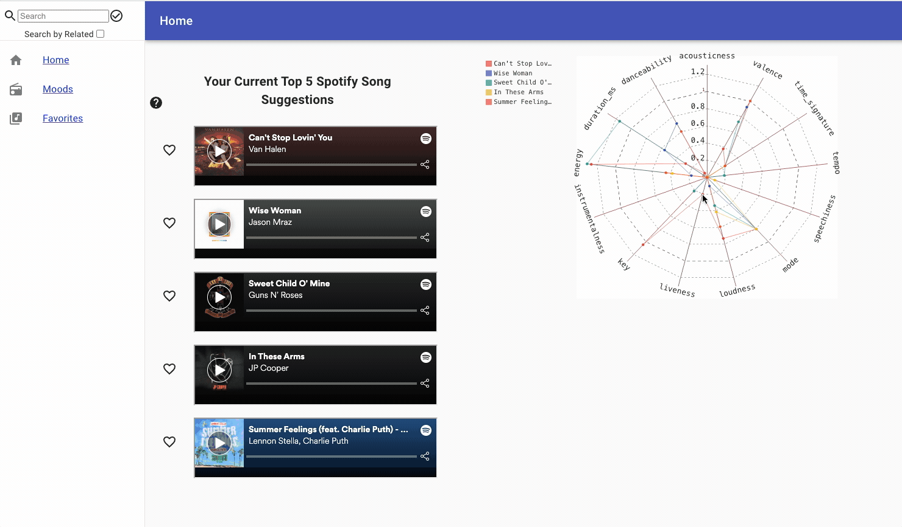
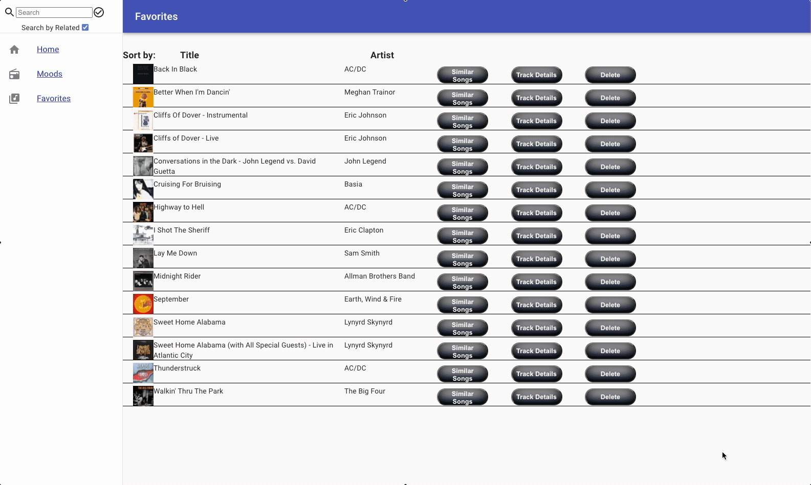
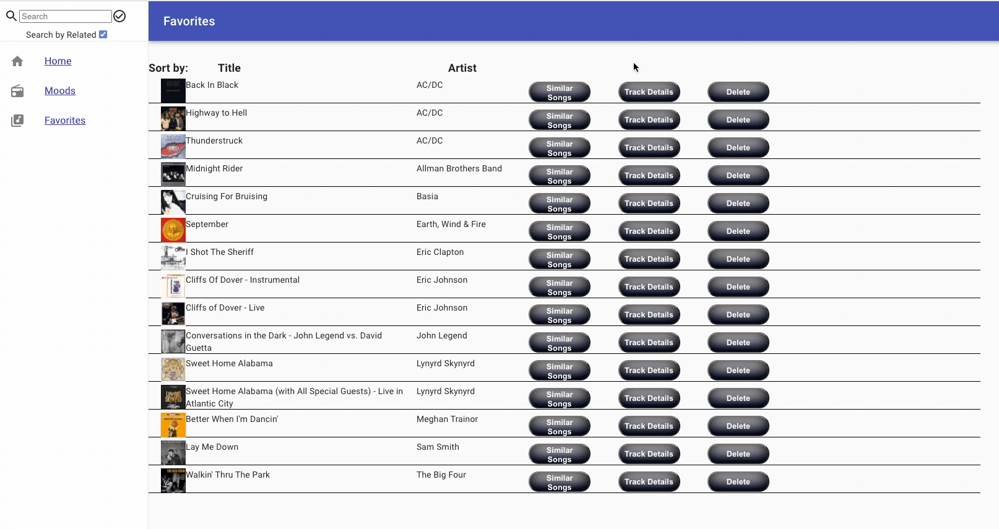

# Spotify Song Suggester
- This project is a collaboration of Data Scientists and Web Developers working together to produce a wonderful interactive
tool that allows a User to dynamically discover new music. This is can work in three ways.
   

### 1. Based On Favorites:
- Every song a User has favorited has 13 values. The list of songs in Favorites gets fed into a data science alogorithm and returns a single set of 13 values that gets fed into the Spotify API.
- The curating process refines the search to return 5 songs most similar to the current body of songs in the User's Favorites.
- A graph is then produced to show the songs presented and their values relative to the 13 values by which music is categorized in the Spotify database.
- Simply Sample a song, add to favorites, and watch your recommendations slowly change as your music selection grows
 

- See below a GIF of the populated results based on favorite songs:

  

### 2. Based On Average Mood:
- The average mood is calulated from the sum of your Favorites list. This mood is not like a genre but rather a median of the "feeling of the songs".
- This value set is calculated and refined via the data science algorithm and returns a suggested top 5 songs.
- Note that the User can search for a mood by setting the values displayed.
 

- See below a GIF of a User selecting a mood:

### 3. Based On Individual Track Details:
- Every song in Favorites has the ability to see a graph displaying the exact details of the selected song.
- By selecting the 'Similar Songs' button the User submits those values to return a set of 5 similar songs.
 

- See below a GIF of searching for similar songs:

## My Role:
- I built the Front End using React, ES-6 JavaScript and Styled-Components.
- All components were custom built.
- I coordinated with Data Science Team to meet visualization needs for song and graphical displays.